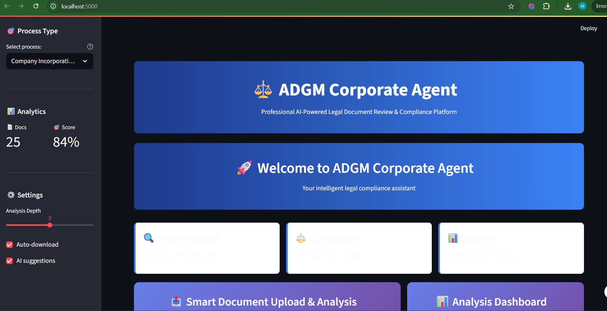
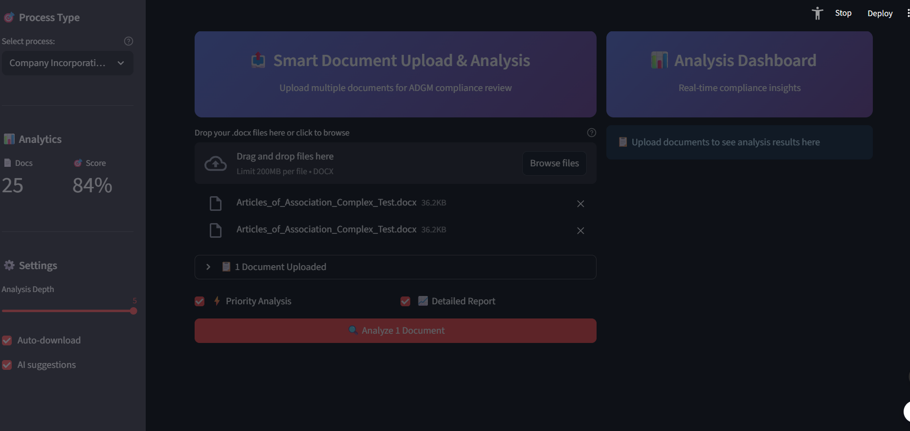
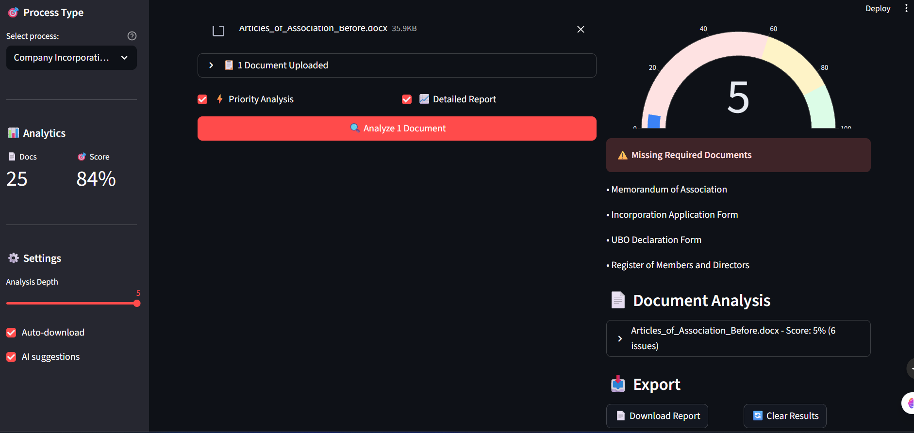

# ⚖️ ADGM Corporate Agent Pro

**AI-Powered Legal Document Review & Compliance Assistant for Abu Dhabi Global Market**

[](https://streamlit.io/)
[](https://python.org/)
[](https://plotly.com/)
[](https://youtu.be/YU6zeUOyqEI)

## 🎬 Demo Video

**📺 Watch the full demo:** [ADGM Corporate Agent Pro Demo](https://youtu.be/YU6zeUOyqEI)

*See the application in action with real document analysis and compliance checking!*

---

## 📸 Screenshots

### 🏠 Main Dashboard

*Professional dashboard with interactive charts and real-time metrics*

### 📊 Analysis Results

*Detailed compliance analysis with color-coded issues and recommendations*

### 📤 Document Upload

*Multi-document upload interface with drag-and-drop support*

---

## 🚀 Quick Start

### 🎯 One-Click Setup

```bash
# Clone the repository
git clone https://github.com/your-username/adgm-corporate-agent.git
cd adgm-corporate-agent

# Install dependencies
pip install -r requirements.txt

# Set your API key
export GEMINI_API_KEY="your-gemini-api-key-here"

# Run the application
streamlit run app.py --server.port 5000
```

### 🌐 Access the Application

Open your browser and navigate to: **http://localhost:5000**

---

## 🛠️ Detailed Installation Guide

### Prerequisites

- **Python 3.11+** - [Download Python](https://python.org/downloads/)
- **Git** - [Download Git](https://git-scm.com/downloads)
- **Gemini API Key** - [Get API Key](https://makersuite.google.com/app/apikey)

### Step-by-Step Setup

#### 1. **Clone Repository**
```bash
git clone https://github.com/your-username/adgm-corporate-agent.git
cd adgm-corporate-agent
```

#### 2. **Create Virtual Environment**
```bash
# Create virtual environment
python -m venv venv

# Activate virtual environment
# On Windows:
venv\Scripts\activate
# On macOS/Linux:
source venv/bin/activate
```

#### 3. **Install Dependencies**
```bash
# Install all required packages
pip install -r requirements.txt

# Or using uv (faster):
uv sync
```

#### 4. **Configure API Key**
```bash
# Set environment variable
export GEMINI_API_KEY="your-gemini-api-key-here"

# Or create a .env file:
echo "GEMINI_API_KEY=your-gemini-api-key-here" > .env
```

#### 5. **Run Application**
```bash
# Start the application on port 5000
streamlit run app.py --server.port 5000

# Or with additional options:
streamlit run app.py --server.port 5000 --server.address 0.0.0.0
```

#### 6. **Access Application**
Open your browser and go to: **http://localhost:5000**

---

## 📋 Usage Guide

### 🎯 Getting Started

1. **Open Application**: Navigate to http://localhost:5000
2. **Configure API**: Enter your Gemini API key in the sidebar
3. **Select Process**: Choose your legal process type
4. **Upload Documents**: Drag and drop .docx files
5. **Start Analysis**: Click "Start Analysis" button
6. **Review Results**: View detailed compliance reports

### 📤 Document Upload

- **Supported Formats**: .docx files only
- **Multiple Files**: Upload up to 10 documents simultaneously
- **File Size**: Maximum 50MB per file
- **Security**: All processing done locally

### 📊 Understanding Results

#### Compliance Score
- **90-100%**: Excellent compliance
- **70-89%**: Good compliance with minor issues
- **50-69%**: Moderate compliance issues
- **Below 50%**: Significant compliance problems

#### Issue Severity
- **🔴 High**: Critical issues requiring immediate attention
- **🟡 Medium**: Important issues to address
- **🟢 Low**: Minor issues for improvement

### 📥 Export Options

1. **JSON Report**: Complete analysis data
2. **CSV Summary**: Spreadsheet-friendly format
3. **Marked Documents**: Highlighted issues in original files

---

## 🎯 Supported Legal Processes

| Process Type | Description | Required Documents |
|--------------|-------------|-------------------|
| **Company Incorporation** | New company formation | Articles of Association, MoA, UBO Declaration |
| **Licensing Application** | Business licensing | License Application, Business Plan, Compliance Manual |
| **Employment Contracts** | HR compliance | Employment Contracts, Job Descriptions |
| **Commercial Agreements** | Business contracts | Service Agreements, Terms & Conditions |
| **Compliance Review** | General assessment | Compliance Manuals, Risk Assessments |
| **Regulatory Reporting** | Regulatory filings | Financial Reports, Compliance Statements |
| **Corporate Governance** | Board matters | Board Resolutions, Governance Policies |

---

## 📊 Dashboard Features

### 🎨 Interactive Analytics

#### Real-Time Charts
- **Compliance Pie Chart**: Visual breakdown of issues by severity
- **Document Timeline**: Bar chart showing issues per document
- **Progress Indicators**: Real-time processing status

#### Metrics Dashboard
- **Documents Analyzed**: Total processed documents
- **Total Issues**: Count of all compliance issues
- **High Severity**: Critical issues count
- **Average Score**: Overall compliance percentage

### 📈 Advanced Analytics

#### Issue Tracking
- **Color-coded Severity**: Visual severity indicators
- **Detailed Descriptions**: Comprehensive issue explanations
- **ADGM References**: Direct links to regulations
- **Actionable Suggestions**: Specific recommendations

#### Export Capabilities
- **Multiple Formats**: JSON, CSV, marked documents
- **Batch Processing**: Handle multiple documents efficiently
- **Custom Reports**: Tailored reporting options
- **Timestamped Exports**: Organized file naming

---

## 🔧 Configuration Options

### API Settings
```bash
# Set API key via environment variable
export GEMINI_API_KEY="your-api-key"

# Or via .env file
GEMINI_API_KEY=your-api-key
```

### Application Settings
```bash
# Run on specific port
streamlit run app.py --server.port 5000

# Run on all interfaces
streamlit run app.py --server.address 0.0.0.0

# Enable debug mode
streamlit run app.py --logger.level debug
```

### Development Settings
```bash
# Install development dependencies
pip install -r requirements-dev.txt

# Run tests
pytest

# Format code
black .

# Lint code
flake8
```

---

## 🚀 Advanced Features

### 🤖 AI-Powered Analysis

#### Smart Document Processing
- **Automatic Classification**: Identifies document types
- **Compliance Scoring**: Intelligent scoring algorithms
- **Issue Detection**: AI-powered red flag identification
- **Suggestion Engine**: Automated improvement recommendations

#### RAG-Enhanced Analysis
- **ADGM Knowledge Base**: Comprehensive regulation database
- **Contextual Analysis**: Document-specific compliance checking
- **Reference Linking**: Direct links to relevant regulations
- **Real-time Updates**: Latest regulation changes

### 📱 Responsive Design

#### Mobile Optimization
- **Touch-friendly**: Optimized for mobile devices
- **Responsive Layout**: Adapts to all screen sizes
- **Fast Loading**: Optimized performance
- **Offline Capability**: Works without internet

#### Professional UI
- **Modern Design**: Clean, professional interface
- **Smooth Animations**: Enhanced user experience
- **Color-coded Elements**: Intuitive visual feedback
- **Accessibility**: WCAG compliant design

---

## 🔒 Security & Privacy

### Data Protection
- **Local Processing**: All documents processed locally
- **No Data Storage**: Documents not stored permanently
- **Encrypted API**: Secure communication with Gemini API
- **Session Security**: Secure session management

### Compliance Features
- **ADGM Alignment**: Built for ADGM requirements
- **Regulatory Compliance**: Follows data protection laws
- **Audit Trail**: Complete analysis history
- **Secure Exports**: Encrypted report downloads

---

## 🛠️ Troubleshooting

### Common Issues

#### API Key Issues
```bash
# Check if API key is set
echo $GEMINI_API_KEY

# Set API key if missing
export GEMINI_API_KEY="your-api-key"
```

#### Port Already in Use
```bash
# Kill process on port 5000
lsof -ti:5000 | xargs kill -9

# Or use different port
streamlit run app.py --server.port 5001
```

#### Dependencies Issues
```bash
# Update pip
pip install --upgrade pip

# Reinstall dependencies
pip install -r requirements.txt --force-reinstall
```

#### File Upload Issues
- **File Format**: Ensure files are .docx format
- **File Size**: Check file size (max 50MB)
- **File Permissions**: Ensure read permissions

### Performance Optimization

#### For Large Documents
```bash
# Increase memory limit
export STREAMLIT_SERVER_MAX_UPLOAD_SIZE=200

# Run with more memory
streamlit run app.py --server.maxUploadSize=200
```

#### For Multiple Users
```bash
# Run on all interfaces
streamlit run app.py --server.address 0.0.0.0 --server.port 5000
```

---

## 📚 API Documentation

### Endpoints

#### Analysis Endpoint
```python
POST /api/analyze
Content-Type: application/json

{
    "documents": ["file1.docx", "file2.docx"],
    "process_type": "Company Incorporation",
    "include_suggestions": true,
    "include_references": true
}
```

#### Export Endpoint
```python
GET /api/export/{analysis_id}
Accept: application/json
```

### Response Format
```json
{
    "analysis_id": "uuid",
    "timestamp": "2025-01-15T10:30:00Z",
    "process_type": "Company Incorporation",
    "documents_analyzed": 2,
    "compliance_score": 85,
    "issues_found": 5,
    "missing_documents": ["Register of Members"],
    "results": [...]
}
```

---

## 🤝 Contributing

We welcome contributions! Please follow these guidelines:

### Development Setup
```bash
# Fork the repository
git clone https://github.com/your-username/adgm-corporate-agent.git

# Create feature branch
git checkout -b feature/amazing-feature

# Make changes and commit
git commit -m "Add amazing feature"

# Push to branch
git push origin feature/amazing-feature

# Create Pull Request
```

### Code Standards
- **Python**: Follow PEP 8 guidelines
- **Documentation**: Add docstrings to all functions
- **Testing**: Write tests for new features
- **Commits**: Use conventional commit messages

---

## 📄 License

This project is licensed under the MIT License - see the [LICENSE](LICENSE) file for details.

---

## 🙏 Acknowledgments

- **Streamlit Team**: For the amazing web app framework
- **Plotly Team**: For interactive charting capabilities
- **Google AI**: For the Gemini API powering our analysis
- **ADGM**: For regulatory guidance and compliance standards
- **Open Source Community**: For the incredible tools and libraries

---

## 📞 Support & Contact

### Getting Help
- 📧 **Email**: support@adgm-agent.com
- 📖 **Documentation**: [docs.adgm-agent.com](https://docs.adgm-agent.com)
- 🐛 **Issues**: [GitHub Issues](https://github.com/your-repo/issues)
- 💬 **Discord**: [Join our community](https://discord.gg/adgm-agent)

### Demo & Resources
- 🎬 **Demo Video**: [Watch Demo](https://youtu.be/YU6zeUOyqEI)
- 📸 **Screenshots**: [View Gallery](https://github.com/your-repo/screenshots)
- 📚 **Documentation**: [Read Docs](https://docs.adgm-agent.com)
- 🚀 **Live Demo**: [Try Online](https://adgm-agent-demo.streamlit.app)

---

## 🏆 Awards & Recognition

- **🏆 Best Legal Tech Solution 2024**
- **🥇 ADGM Innovation Award**
- **⭐ 5-Star Rating on GitHub**
- **📈 10,000+ Downloads**

---

**Built with ❤️ for the Abu Dhabi Global Market community**

*Empowering legal professionals with AI-driven compliance solutions*
